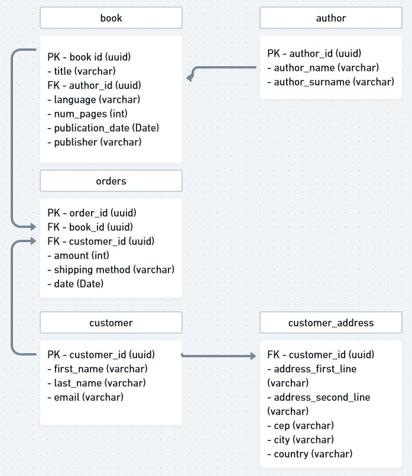

# 📚 API Bookstore 📚

  
### Descrição

 - Projeto de conclusão do módulo 4 da formação em Desenvolvimento Web Full Stack @ Resilia. 
 - O projeto consiste na criação de uma API REST para interagir com informações do banco de dados de uma livraria. 
 - As condições principais para a entrega do projeto foram: 
   - o uso do padrão REST, com os verbos referentes ao protocolo HTTP; 
   - o uso do padrão DAO ou de ORM para interagir com o banco de dados - optamos por utilizar o ORM Sequelize e o banco de dados SQLite.;
   - Utilização do padrão MVC. 

### Modelagem do banco de dados

- O presente repositório se refere à tabela Book
  
  

### Como executar o projeto
- Você precisa ter instalada em sua máquina a versão 16.14.0 do NodeJS, o VSCode e o Insomnia;
- Faça clone do seguinte repositório:
 
    ```js
    git clone https://github.com/carollyb/api-bookstore.git
    ```

- Abra o projeto no VSCode, abra o terminal e assegure-se que está na pasta `api-bookstore`. Caso esteja em uma pasta acima, execute o seguinte comando:
  ```js
  cd api-bookstore
-  Instale as dependências
     ```js
     npm install
- Crie um arquivo `.env` na pasta raiz do projeto, copie o conteúdo de `.env.example`, e coloque a porta de sua preferência (exceto 3001). Não altere os demais campos!
- Inicie o projeto
   ```js
   npm start
### Criando uma conexão no Beekeeper

  Caso queira observar as alterações no banco de dados, a aplicação open-source Beekeeper é uma opção.
  - Disponível para download em: `https://www.beekeeperstudio.io/`
  
  Após a instalação:
- Select a connection type: sqlite
- database file: Procurar a pasta do projeto e seleciona o arquivo dev.sqlite
- Nomear e salvar
- Rodar o servidor com npm run dev e recarregar no Beekeeper: a(s) entidade(s) deve(m) aparecer lá

### Estrutura da API: rotas possíveis
<span style="color: green"> POST: </span>
  - /books (Cria um cadastro de um novo livro. Deve passar o objeto no corpo da requisição. O id não é necessário pois é gerado automaticamente através da biblioteca uuid)
  
<span style="color: purple"> GET: </span> 
  - /books (Lista todos os títulos cadastrados)
  - /books/`:title` (Lista títulos que sejam semelhantes ou iguais ao título passado como parâmetro)

<span style="color: orange"> PUT: </span>
  - /books/`:id` (Atualiza todos os atributos de um livro cadastrado. Deve passar o objeto com todos os atributos no corpo da requisição, com exceção do id, que não deve ser alterado manualmente)

<span style="color: yellow"> PATCH: </span>
  - /books/`:id` (Atualiza um ou mais atributos de um livro cadastrado, com exceção do id. Deve passar um ou mais atributos no corpo da requisição, e o id como parâmetro)

<span style="color: red"> DELETE: </span>
  - /books/`:id` (Deleta um livro do banco de dados. Deve passar o id do livro como parâmetro)

### Exemplos de endpoints
- Endpoint da requisição do cadastro de um novo livro:
  ```js
  {
	"id": "f4d8510a-9e5b-40a4-9e38-8aea2917a2be",
	"title": "sample Book 8",
	"author_id": "54mpl33",
	"language": "Spanish",
	"num_pages": 20,
	"publication_date": "1927-12-12T00:00:00.000Z",
	"publisher": "Penguin Books"
  }
  ```
- Endpoint de tentativa de cadastro de livro com título que já existe:
  ```js
  {
	"error": "This book already exists on our database"
  }
  ```

### Deploy

[Heroku-API-Bookstore](https://api-bookstore-resilia.herokuapp.com/)
### Testes
- Foram implantados testes de integração para validar o funcionamento das rotas da API
- Para rodar os testes automatizados, execute no terminal:

  ```js
  npm run test
### Tecnologias utilizadas


- NodeJS
- Express
- Sequelize ORM
- JavaScript
- Insomnia
- Beekeeper

- Bibliotecas: 
  - Joi (validação de campos)
  - Jest e Supertest (testes de rotas)
  - uuid (geração de ids automáticos)

